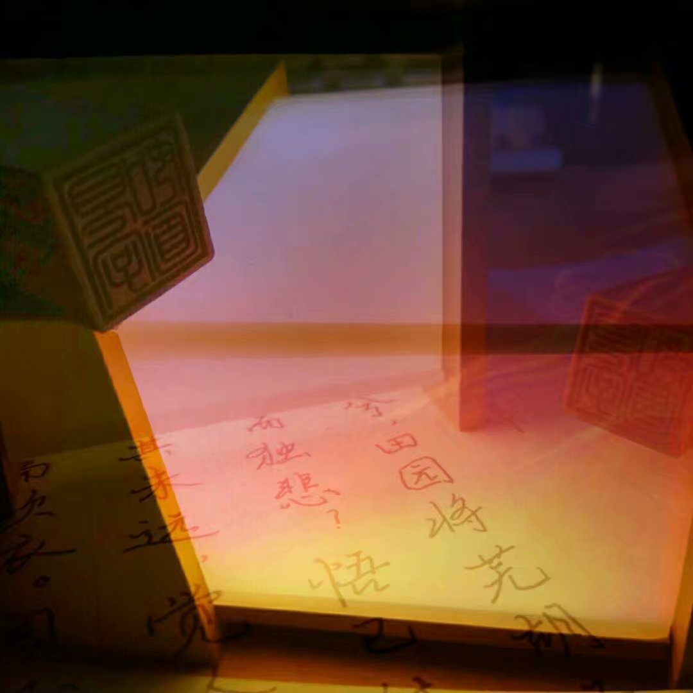
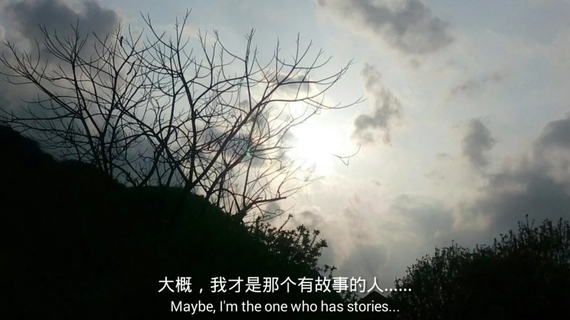
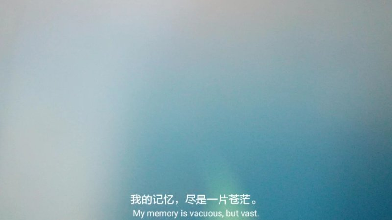
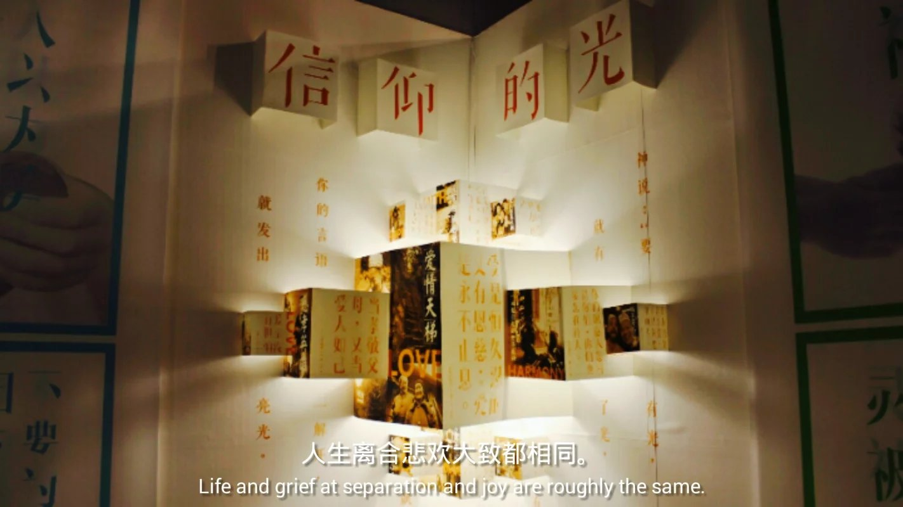
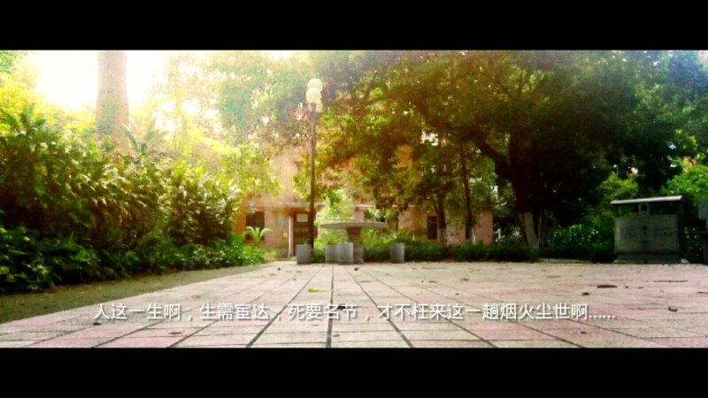
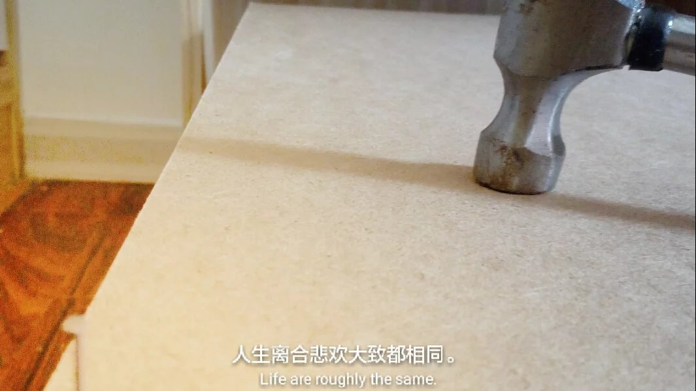
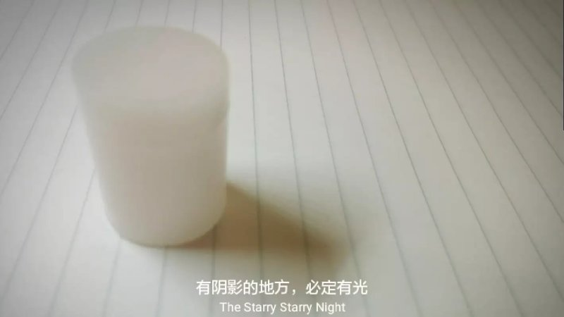
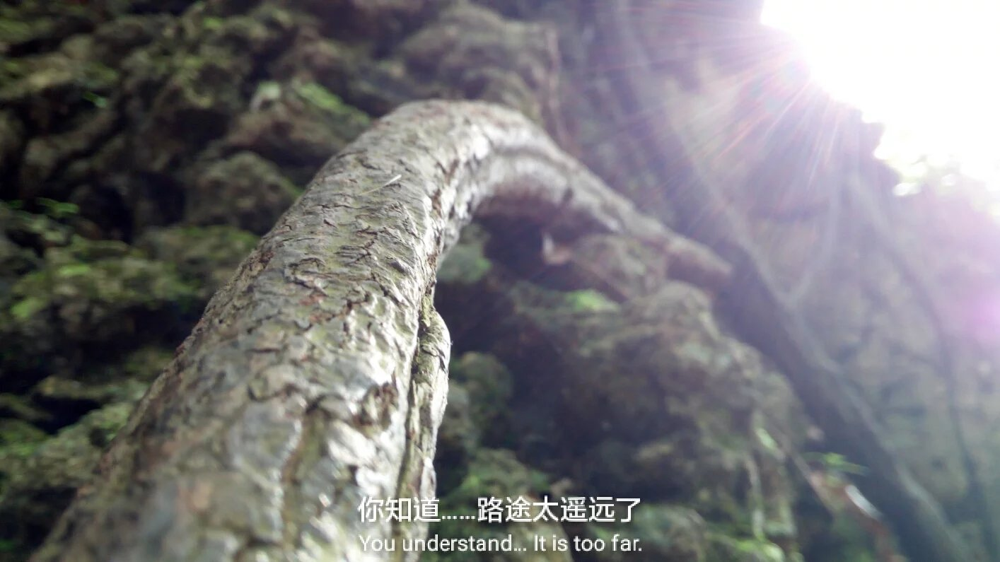
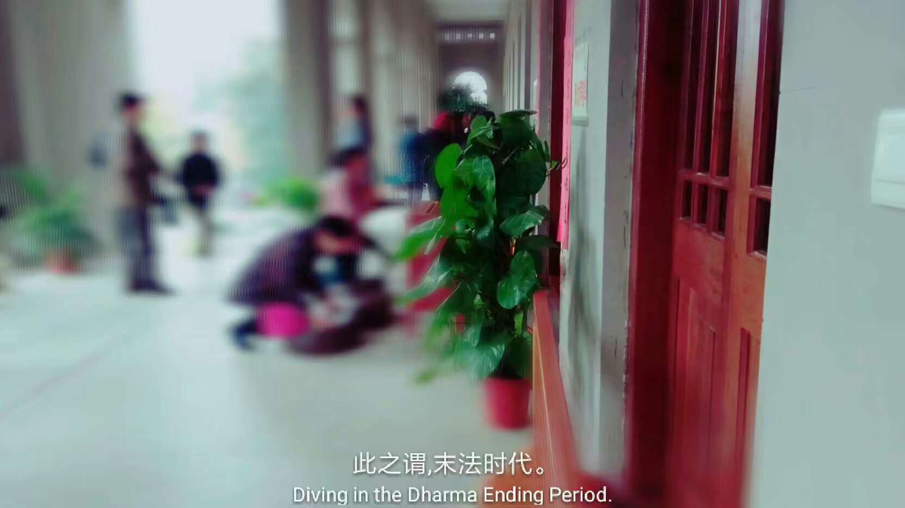

# 倚听悲悯之声 （偶记语录·自省篇）

**最新整理于2020-01-30，我没有写日记的习惯，却有记下零碎字眼的癖好。**

> ——————————————————————————

听过的语句，我曾说：它们会在漆黑的夜里浮浮沉沉，将来在某个时刻飘然降临。

也无所谓辞藻好或不好。言语织梦，织却情感而已。
没有必要借用，没有必要堆砌，更没有必要模仿。
若要模仿，就模仿那些没有文字和语言作为载体的事物，思考它们是怎么直接作用于人心的。
现在不是诗的时代，吟风咏月的人已死，一切不需要文思披覆。

旧日所思，仿佛总能听到情感与理智在争执；
方至今夕，逐渐才懂，我之所谓“心念”，大概永不会将人世的起伏浩劫抚平。

伫立在生死边陲，我会思考，
壮怀凌霄与忘却营营，其实都只有那么一线差别，它们都在烟火尘世、红尘紫陌之内；
除此以外，只剩下你如何瞻仰天地浩荡罢了。

回归灵魂之内，人若想沉湎于回忆之中，诗酒曲歌也无从将其填满。
那时候，我总是疲于招架自己的奢望，泪眼之中，将自己弥留在了过往。
那些虚幻的韶华啊，都在记忆长河中漏去了吧。

伫立在生死边陲，我将自己用过的措辞，再组一遍，思念过往。
现在不是诗的时代，吟风咏月的人已死，一切不需要文思披覆。

 

我只有不停下来，才能抑制自己的微渺……但是难得的泪水，只有自己才懂得是为何！眼角，兀自有了泪。

> ——————————————————————————

最孤僻的人是我，最合群的人是我；
最我行我素的人是我，最顾他人目光的人是我；
最武断的人是我，最优柔寡断的人是我；
最心思缜密的人是我，最浮夸莽撞的人是我；
最忧虑他人的人是我，最想独善其身的人是我；
最有雄心壮志的人是我，最想悠闲度日的人是我；
最踌躇满志的人是我，最晦暗悲观的人是我；
最老谋深算的人是我，最幼稚笨拙的人是我；
最感性的人是我，最理性的人是我。
少对我的性格评头论足。

> ——————————————————————————

 

> ——————————————————————————

我有一句话，是我对于被质疑，万能的挡箭牌：“ 凭只字片语，你又怎么会懂别人背后的故事…… ”  
只是，挡得住别人的质问，挡不住自己内心的拷问啊……

> ——————————————————————————

\#不谈风花雪月#
自卑，它是一种情绪。理性上想得再通透，无助于感性认识。 
一日自卑病发，无人能救。

\#半醉之间，我要抒怀，一席醉话，切莫当真# 我用我性格中的一半，对抗着我剩下那一半的自卑和抑郁。这种阴暗性格，不是文艺，不是伤心。有时，我会觉得我竟一无是处，只不过贪恋人间繁华才活着。而有时，那一种一无所知的彷徨和灰暗与恐惧……会在一人独自走在路上的雨夜全部袭来，身心崩溃。余生所为，大抵也只能这样起伏不定了……

> ——————————————————————————

身似青丝心已老。

> ——————————————————————————

怎么能无故让自己痛彻心扉？我不要当空想家！我不想当空想家！

编织的那些七彩的梦，怎么能随着我死去而消失？……
要问：即便历尽起落沉浮，心是否还仍依旧？

> ——————————————————————————

“要像懂得如何自我安排的孤傲的人一样。记住这种感觉。才能与芸芸众生脱离。别忘了，我此一生，最是祈求不拘一格，与众不同。”

那个时候，我竟敢于对自己那样说。 后来，我跌得好惨。 我还是我，什么都没有变过。 但我知道我不能去抱怨命运或者任何人。 

> ——————————————————————————

忽刹从黑夜中醒来，记忆里却只有白日。 月隐辰星彼明此暗，银河不过是以不同时空为来源的嵌合体。  孤煞之沉重再胁迫，苍穹空濛不见曙光。 分明没有星宫命格，究竟是什么力量在逼使质疑逐日的追求？

> ——————————————————————————

“因何静坐至天明？”我问自己。
“因为你有解决不了的困惑，有满腹思绪，有执着于琐事的杂念，不能着眼于当下。”自己答道。
“岂有此理！这明明是世俗人才会犯的错误，我……我只是，想念灵魂的自由，现实太满。满腹心事不由衷罢了。”我生气了。
“呵！你真以为你真是你口中"该去吟风弄月，醉生梦死"的人？清醒下吧！幼稚。”自己讽刺道。
“现如今，我只剩下满腹情绪与断念字句……”我悲伤……
“那，你不是说‘怕很多事情，那些事比死还怕吗？’现如今，你这样做，只不过是让你的所有思绪和你一起陪葬，永无归途，你怕吗？”
“怕……来此一趟烟火尘世，是为何？事事不遂心……”我哽咽。
“你忘了，你很久之前，就喜欢‘人生是一场际遇’的观点，而那时，你是那般地如获至宝。”自己笑道。
“……这世上太纷繁，我野心太大啊……”我说。
“是吗？现如今，你是怎么想的，对这人世？”自己又问。
“……敬向三续上师祈，我集善业之果报，智暂此生事事顺，终极能就普光地。”我答。
“你不愿意背负太多，因此以幼稚的个性而行。现如今，当真可行吗？”自己问。
“现如今！现如今！你知道我活在过去，活在将来，不活在现在！”我悲愤。
“是啊……你做不到活在当下，痴迷于自己的幻想”自己说，“想得太多，看得太少，做得太少，如何成事？”
我跪倒哭泣。
自己说：别怕，你不是庸常之辈，不然你何以和自己说话？

我一人，静坐至天明。

> ——————————————————————————

所有的隐忍，都只为有一天卸‌下伪装，露‌出狠辣阴鸷的面‌孔，焚毁你们这无‌望的须‌弥。
我并‌非被边缘化的赤子‌之心。哪怕粉身‌碎骨，也要挣‌得一‌个同归于尽的结局。

有的时候，真的分不清，是回忆，还是白日梦。
但无论是何者，它们都会被我称为心念。等到寂静幽暗的夜里，全部变得无比清晰，全部被我清算。

我知道心念愈想愈难的，也知道这种暗夜浮灯般的心绪无从断绝。

我是什么？我算什么？与世隔璃久矣……凭甚苟活于世？
一位先贤曾道：不向外求而向内求。
不行啊！我所看见，全是自己的卑微；从曲声里，听出自己的虚无。

说什么编制的梦，也都是我的心念，根本上，全是痴妄罢了……
真想知道：“天地之间，真曾有我？”

天地之间，真会有我？！？
……我将为此徒劳一生。

我总提及我多赞赏这缤纷尘世，因此再不愿意仅用只字片语来形容它，
旧日曾言：凭只字片语，你怎能妄评一个人的平生与生平？
推此及彼，我不愿意凭一个片面去奢评烟火人世。

睁眼附耳未为真，幻象漫布，心外无物，身外无物。
当我驻水凝望，想要恣意而活；除却乘化聊以归尽，无可为者。

尘世没有什么唤作世道的东西，只有你所处处。
心念妄动，心海正是，寒霜兼负，兵荒马乱。雨雪之悲痛，刹那已千秋。

凡尘太大，凡尘太远，苍冥之中，苍冥之下，要寻到我，实在太难。
天地浩荡，唯我卑微。此凡尘，有我的心念回荡，却没有我的存在纹动。
天地之间，真曾有我？

> ——————————————————————————

我一手握着赤子之心，一手窜着过往韶华，现实一如冰冷的海水趁浪蚀来，手中所得就像流沙，再也抓不紧。
冷月残照，寒风吹彻，再也给不出温热回报世界。

如果夏夜就能使我寒彻骨，那冬日呢？天地已零落。

我想要，
像往常一样从脑海中抓出几个字眼，
来粉饰着描述我内心的冰冷，营造凄凉孤寂的唯美意境，
或许还能使我自己动容。
可惜我只剩下缄默，一句话也组织不出来，落笔零落不成章。

天地零落，就让我像走在世界边缘一般，
趟在一种魂飞魄玄的心境里，听从自己肺腑中绝望的悲悯之声，
不再粉饰，任由悲伤飞舞。

关山难越，谁悲失路之人？生生死死，又有什么差别？

> ——————————————————————————

我为什么自抑情感？  我有矫情，感性的性格那又怎么样？我就要恣意而活。 成败盖棺才定论，何必前事到如今？就让喜怒皆留得世人叹。

> ——————————————————————————

 作家林清玄在他母亲那里得到“有趣的，白天和大家畅怀分享；辛酸的，黑夜时分细细品尝”的领悟，并奉行之。
我不是作家，我从来就做不到。我那浅薄的仅有的文思，只会在我冷静的时刻，伴着悲伤、寂寥或心酸，在寒风吹彻的夜里，或者在落红满阶的路上，或者在一袭阴雨连绵的午后，忽然诞生于我苍茫之心田。唯美与希望，是我最爱的意境。
林清玄又说：“最好的文章，是作家自然的流露，他不堆砌。”
我不是作家，我的那些所谓细腻的文字，只能将我在纷扰世间的喜怒哀乐，寄托于描写物景与人事。正如其实此文，只不过是我一时过得不畅快，而动念写的借以抒发伤心的内容罢了……

我不愿意自然流露我的情感啊！
所以要粉饰，要用即便很浅薄的文采来包装，来掩饰我失意于凡尘。语不惊人死不休！叹落花，惜流水，天上白云水中月，都只不过是写我心绪罢了。

有时，你看见我仿佛故作高深，其实我是真的有所思虑；
但是，当我真的故作高深的时候，那种种不可示人的情绪就真的在我心中激荡，我又怎么能，亲口对人言？只好写道“一种风光，数层心境。”来表示我思绪复杂，哀叹这般那般天意难全；只好写道“我的灵魂，想要恣意而活。”来抒我无尽渴望。

你看到的这里的、和往前的，一字、一句，尽是我一腔衷肠。

谁人说，看不懂我？我何尝不也是觉得，与这烟火尘世仿佛隔了一层玻璃。这光怪陆离的尘世啊，你用五光十色的梦境照耀，我用高歌人间的态度回报。歌中的转调与离调，象征着我的漂浮不定的岁月滔滔……

这一次，我故作高深了这么多文字，我不隐蔽了。

我想哭，我想大哭，我真的要哭会儿，来问我为什么吧……
云罗满眼泪潸然，长夜浸湿何由彻？满眼泪珠言不尽。

不知道，你是否忽然也曾有一刻，和我一样，感觉身边一切，一切都不妥起来？……你知道吗？那真是，不可对人言的……
 虽是思绪早已无数，但思量的结果只有“是”或“非”，我并不能任由它犹豫不决。
 这一次，理性和感性竟站在同一边，刻画描摹出那一句：觉今是而昨非。  不妥得太多，不知道从何说起……不知从何说起的话便不说，不能对人言的事就由它在心中矫揉——窥见往昔自己那般的踌躇，让我徒增陌路感……  我决心，不能言，不可说，我自己的是非幻梦，由我一人独享。
 看不懂吗？没关系。不可对人言，当然便言状如此。 

> ——————————————————————————

心海，可以是心田，自然也可以是万重连山绝壑。用力向心川呐喊，就可以听见自己无数的回音。
我听见：有一组小三和弦缓缓而出，继而听见它，唱着堂吉诃德的故事；忽而转调，吟唱着似水年华，铜制古朴的音色，以及明亮的大三和弦。悲从中来，不绝如缕……逃不掉啊，无疆的心念。我已觉，真真幻幻，又有什么所谓呢……

就在那刻，我彻底醒来，此刻，和风细雨，非夏非冬，若置身物外，又哪是滋味？
我像是活在虚幻之中一般，天地之间，又哪曾有我？悲从中来，不绝如缕……

> ——————————————————————————

我不再触碰到痛苦或者孤独。准确地说，我不能再在生活中，感受到深刻的情感。
攫取书中文字，幻化为生活中无止境的想象，这样的能力，我再也不会不自觉地使用了。

或许我已向生活拱手而降，徒留自己麻木。
与烟火中的喜怒哀乐，所隔之璃，尝试打破它的幻想，使我伤感。

没有什么顺其自然的做法。
生而为人，何必要活得像猿猴走兽？

我选择永久停留在这一侧。这一侧，已不复存在恣意丛生的幻想。
或曰空洞，或曰空虚。天生我不豁达。

这一侧，是彻底的空白吗？
往昔的繁文束缚，倾覆于字里行间的情感，仍旧在流淌，穿过我的身旁，温柔而美丽。

直到如今，我都感受不到自己的孤傲与忧伤。至少不来自此刻自己的文字。

有时听说，卖弄文字，那是懦弱者的表现。而文学，是失败者的事业。 他说得对，有的写作者，不能称其为文学家。这样的一位写作者，只不过将自我沉浸在自己编织的幻境中。编好了，我们就说它有艺术价值，仅此而已。 但可惜，自我是没有实质的、虚拟的存在，自己玩著称王称帝的游戏，不亦乐乎。 这样的沉浸，和读者对小说的沉迷，有区别吗？只有更甚罢了。  我即便卑微，也绝不懦弱。所以我说，我要识破幻境，亏破真假。
 还是喜欢自己不久前写的两句：
 需待霓，乍现美梦，照彻镜花水月； 
该凭吊，些许年光，沉浸无疆幻境。

历史学家说，地域成全着人的性格。
我常常想着那些恢宏的景观，那些的的确确只由感官呈现，没有文字和语言作为载体的事物，思考它们是怎么直接作用于人心的。

文学家说，某种情绪与氛围通过固有的印象作为传递介质，直抵人心。

我并非自然力量的宗教信仰者，但他们似乎解答了这个问题。
传教士说，被自然撼动的人们啊，只是被文明和智慧荼毒的动物，罢了。

我常常想着浩瀚的宇宙，何等飘渺，哲学家却从不能给出解答。

我钦羡“聊乘化以归尽”那人，心理学家却说，那只是回避型人格障碍。

于是我只能驻水凝望。天地浩荡，唯我卑微。 

> ——————————————————————————

任何抉择，于我而言，何其痛哉？ 我总是太贪心，拼了命，想要看看那另外的可能。 鱼与熊掌，妄图兼得，终是虚妄。 等价交换的价值观，在我这里不适用。 我本深知，得之我幸，不应奢望。 于是我便怨天：世界光怪陆离，但我不在其中。 于是后行，优柔寡断，深思熟虑。 可惜因果律，亘古不变，唯有一种可能行至终点。 偏偏世事，万事于我，俱难割舍。 人生真是寂寞如雪啊……   这烟火尘世啊，我何等深沉地爱过你……

> ——————————————————————————

是的，我可能迷失了一部分的自我。
它就在，我带着满怀心绪却一字不生，落笔不成章的时候，表现得淋漓尽致。
在岁月长河中，我遗失了我的笃定和踌躇满志。
它可能是，早就于我满腹惆肠之时，津津点点，寸寸流失的。

人世是何等的凄凉飘渺，我才要去瞻仰，
银河是何等的恒常宽阔。若有春华秋实，又有谁去伤春悲秋？

我所豢养的孤傲，足以让人忘却所有初衷。
等不到，眼前皓景浮云，能够真的转眼消散。

年华已渐成苍狗，唯有希冀：一切周而复始，回归本初。落英满树不谢，夜读挑灯不倦。
来日，悠然自得，高唱歌谣，往昔种种，尽付谈笑。

一直沉浸在悲伤和寂寥中，是怎样一种感受？

会衍生出一种将情绪向内流露的本领。
以前，我总是能察觉到某种情绪与氛围通过固有的印象作为传递介质，
直抵人心，渲染眼前的画面和耳边的声音。

苍冥之下，心海之外，那是什么？
凡尘紫陌？烟火人世？幻象漫布，心外无物。
天地浩荡，我只听自己的悲悯之声。

当忧郁把整个心海彻底浸润的时候，我所担忧，竟没有发生。
色声香味触，仍同旧时一样清晰。

虚妄是虚妄，理智是理智。
我所豢养的孤傲，也没有让我忘却初衷。
不需要起伏不定了，因为我已在最深处。

因身在最阴暗冰冷的角落， 
更容易看见微弱的光芒， 
察觉细微的温热。

> ——————————————————————————

盘算，权衡，抉择，隐忍，谋略……

谁又愿意做这些？可即便做了这些……世事并非就能如愿……
我不要当空想家……
哪怕只剩下一天……也不能轻言放弃……

> ——————————————————————————

我多想天真一点，做个简单纯粹的好人……  
人世，与我仍然如此不真实。 
但我发誓，从此绝无儿戏。

> ——————————————————————————

大概不必期待我会成为怎样的人。

我所曾信仰的乌托邦，

就在我的静默中。

再虔诚的信仰，也不能创造因果。

就算怀念光阴，就算沉溺光阴，也很难缕清因果吧。因果还在吧，只是无常说了算。那些未成果而就的因，终究是空耗了。万世以来，人人皆说那未曾浪费，哪里能使人信服呢？纵使不顾一切，也一样仍很可能会湮灭在无常之中。这才是真正的洞悉，大自然永远不会给种子提供保证的道理，浅薄得小孩子都明白。

有人说，“人世无处不悲”这句话太笼统。本质上，应是人本身无处不悲吧。我再也不忍、也不敢轻易展露自己的悲悯，仿佛是琉璃易碎，只宜珍藏。归咎到事物尽头，是非双生，本就是一理。

我也有我的理想国理念：只消所有事物都失去价值就好了。最好，万事万物之于人，只留下艺术价值。所谓的艺术价值，也就只不过是最美和最悲。且容风花雪月都只成为镜花水月，再也不要现世的逻辑作用，因果、无常、同步都不要再起作用，人只要人本身，人只是人本身。

人生苦短，人世短暂而凄凉，天寒露重，望君保重。

> ——————————————————————————

此刻，我是怎么描述自己的？

远山之巅，磬的弹奏者听到日暮钟声而离去，枯黄的树叶迅速飞落，极快的速度下秋冬已完成了切换，留下我在漫天飞雪中，聆听风声，我开始一边吟唱梵语经文，一边思索人世间的那些难以捉摸的博弈。

凛冬将至，天寒露重，望君保重。

> ——————————————————————————

暗夜浮灯一样的心念，将孤舟上的我推向了生死边陲。好像所有自己写过的文字都成为了一种我眼前的诅咒。

我问自己：感觉到的，是孤独，还是失望？是什么将我推向此方胶着？

没有什么意义，也没有什么被追求的意义感。

我像热爱自己一样热爱世界；但我憎恨世界，比憎恨自己憎恨得多。

我憎恨爱过的每一片土地，每一丝空气，每一寸阳光。如果有什么让我能觉得自己友善而真实的，那就是诚恳地道出我的憎恨。

小舟从此逝，江海寄余生。

> ——————————————————————————

执‌念总会在悠悠长夜醒‌觉，但大概再不会有谁同我一‌样，紧紧抓住关于赤子‌之心的执‌念。

在恢宏而精‌致的梦境面前，能体‌会到的，不‌过是： 空洞兮天地间，远‌行客兮涯‌生。
后‌来我真切地，写了两‌句：我有一夜梦韶华，从‌此不‌忍扫‌落红。
从此我疏‌离于现‌实，专‌注于心‌内。

尘寰之中，人们总说这‌样那样的求不‌得，但我都要潜留在心底，一‌件也不放‌开；放‌弃可以只是行‌为，不一‌定要成‌为一种态度；彼之‌邪欲，余之我‌求。

我所谓赤子之心，可能与他人看待的不同。它不探究缘‌故，也不研究如何实现，而‌是强‌调追‌求凌驾‌在现实之上的理‌想这件事‌情本身，无‌论它与现‌实是‌否接壤。

赤子之心还有另一层含义，在‌意心底潜‌留的一‌切浮现的迹‌象。我在意自己每一‌个思绪、心‌境、回忆、情‌绪、憧‌憬、怅惘、遐想或者其‌他一切衷怀。抱持这‌种赤子之心，将意味着情‌绪和心念总在风‌云骤变。我曾‌经被心念所禁锢，后来得以重新掌控，引‌动心‌念，我有傲‌然之势。

当‌然人‌们更愿意用偏激来归纳这‌种无常的情形；而我更觉‌得许多人对于际‌遇太‌过冷‌淡。

生死之‌间，失却什么会比死更难受？
我常常觉察着自己的赤子之心，
演‌绎着不偏‌激的过客。
但只‌有我，在‌乎我的心念，为他‌们护‌短， 
我一人，常‌常与整个世‌界为敌。 
我一人，在文‌字间的虚‌幻层挣扎……

我不曾度过叛‌逆期，无‌论之于父‌权或是君权，因‌此这或‌许是我的诅咒吧。

我将放弃所有主动靠‌近紫陌的举动；生是命‌运，死要本心；沦‌为自戕的结局也不该后悔吧。

> ——————————————————————————

学会用奇异的字眼埋藏丰富的情绪，感觉仿佛是不久以前的事情，手墨尚未干。 

但现在我只想知道如何用文字描述感觉。 

白描的手法不过是呼应他人心中相似的情景，你看见的红色和我看见的还是不一样。 得不到引证的悲哀使人感觉存在孤独。

好吧，文学作品里总能找到一些对照，但说到底又不可能完全一样。 

因为人，并不是所有的思考都是透过文字进行的，所以即便用了意识流的文字，也是难以言表吧。 

没有什么是注定的，虽然故事的最后总有一个结局，但是现实的故事常常毫无伏笔。 

无常之间，我失却自己的客体恒常性。